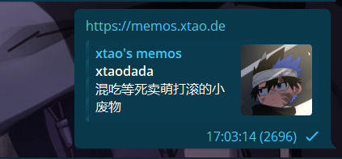

# FixMemos

FixMemos 是一个用于修复 Telegram 上 Memos 预览的工具。通过该工具，您可以确保 Memos 的链接预览在 Telegram 中正确显示，从而提升用户体验。

![][icons]

[![License][licensebadge]][license]

<!-- Links & Badges -->

[icons]: https://skillicons.dev/icons?i=py,fastapi,idea
[license]: https://github.com/Xtao-Labs/FixMemos/blob/main/LICENSE.md
[licensebadge]: https://img.shields.io/github/license/Xtao-Labs/FixMemos

## 功能特点

- 自动修复 Telegram 上 Memos 的链接预览问题。
- 简单易用，快速部署。
- 支持自定义配置，满足不同需求。

## 快速开始

Change `https://memos.xtao.de` to `https://fix-memos.vercel.app/https://memos.xtao.de` in your link



## 部署方法

1. 克隆项目到本地：
   ```bash
   git clone https://github.com/Xtao-Labs/FixMemos.git
   cd FixMemos
   ```

2. 安装依赖：
   ```bash
   uv sync
   ```

3. 启动项目：
   ```bash
   uv run main.py
   ```

4. 按照提示替换您的 Memos 链接，即可完成修复。
